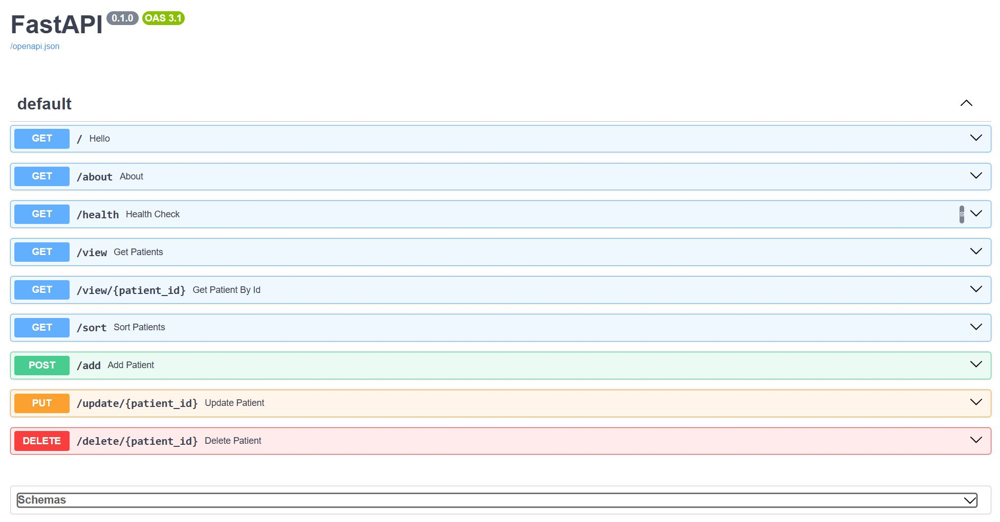

# This is a play ground for the FastAPI page for Patient Management System

## How to run on a Docker instance

01. Make sure Docker is installed and running  
02. Run the following command to build the Docker Image on your local machine.  
      `docker build -t fastapi-app .`  
03. Run the below command to run the app  
      `docker run --rm -p 8000:8000 -v "$PWD/data:/app/data" fastapi-app`  
04. Navigate to http://127.0.0.1:8000/docs in your browser  

## How to manually setup and run in development server on Windows

01. Install python  
02. Create a folder  
03. Clone the repository in that folder  
04. Open Command Prompt  
05. Navigate to the root folder after cloning the repository  
      `cd [full path to repo root folder]`  
06. Run the following command to create a Virtual Environment  
      `python -m venv .venv`  
07. Activate the environment using below command  
      `.\.venv\scripts\activate`  
08. Run the following command to install the dependencies  
      `pip install -r requirements.txt`  
09. Upgrade PIP using the below command [OPTIONAL]  
      `python -m pip install --upgrade pip`  
10. Run the following commands to start the application  
      `CD src`  
      `uvicorn main:app --reload`  
11. In the browser window open the URL which is shown on the command prompt  
      `http://127.0.0.1:8000/docs`  